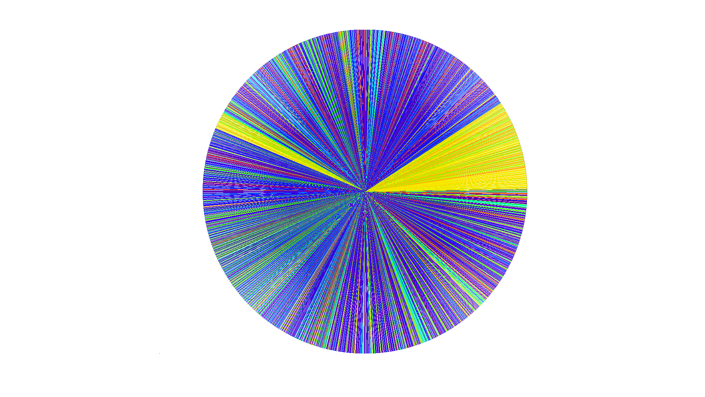

# radialwave

This project is converting a music visualizer I wrote in matlab and I hope to
rewrite in go.

See [_matlab/matlab.m](_matlab/matlab.m) for the original matlab code with
comments I had to write to understand it.

It partitions the song, uses an fft to determine the maximum frequency of that
partition, and stores the max frequency of each partition in order.

It then creates a mapping of unique dominate frequencies to wavelengths of
color.

Then it then can render the song as sections of color based on an mapping the
dominate frequency of each partition to a wavelength of light using the
previous mapping and then mapping that wavelength to RGB with a static
csv file that in golang would be a `[][]float32`. The matlab code draws this
onto a circle from the start of the music to the end of the music.
